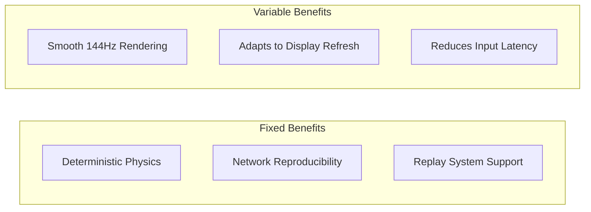

# Engine Loop

This document defines the game loop timing strategy for Aether Engine, ensuring smooth rendering despite decoupled logic and render threads.

---

## Table of Contents

1. [Timing Architecture](#1-timing-architecture)
2. [Logic Loop (Fixed Timestep)](#2-logic-loop-fixed-timestep)
3. [Render Loop (Variable Timestep)](#3-render-loop-variable-timestep)
4. [State Interpolation](#4-state-interpolation)
5. [Frame Timing Diagram](#5-frame-timing-diagram)
6. [Performance Monitoring](#6-performance-monitoring)
7. [Pitfalls and Cautions](#7-pitfalls-and-cautions)

---

## 1. Timing Architecture

Aether Engine uses a **decoupled timing model** where simulation and rendering run at independent rates:

| Loop         | Thread        | Timestep   | Rate              | Purpose                       |
|--------------|---------------|------------|-------------------|-------------------------------|
| Logic Loop   | Logic Worker  | Fixed      | 60Hz / 120Hz      | Deterministic simulation      |
| Render Loop  | Render Worker | Variable   | requestAnimationFrame | Smooth visual output      |

### Why Decouple?



---

## 2. Logic Loop (Fixed Timestep)

The Logic Loop runs at a constant rate using an accumulator pattern.

### Configuration

```rust
// Recommended configurations
const LOGIC_HZ_60: f64 = 1.0 / 60.0;   // 16.67ms - Standard
const LOGIC_HZ_120: f64 = 1.0 / 120.0; // 8.33ms  - Competitive
const LOGIC_HZ_30: f64 = 1.0 / 30.0;   // 33.33ms - Mobile/Low-end
```

### Accumulator Pattern

```rust
pub struct LogicLoop {
    fixed_timestep: f64,
    accumulator: f64,
    previous_time: f64,
    max_frame_time: f64,
    tick_count: u64,
}

impl LogicLoop {
    pub fn new(hz: f64) -> Self {
        Self {
            fixed_timestep: 1.0 / hz,
            accumulator: 0.0,
            previous_time: now(),
            max_frame_time: 0.25, // 250ms cap
            tick_count: 0,
        }
    }
    
    pub fn update(&mut self, world: &mut World, shared: &SharedState) {
        let current_time = now();
        let mut frame_time = current_time - self.previous_time;
        self.previous_time = current_time;
        
        // Prevent spiral of death
        if frame_time > self.max_frame_time {
            frame_time = self.max_frame_time;
        }
        
        self.accumulator += frame_time;
        
        while self.accumulator >= self.fixed_timestep {
            // Preserve previous state for interpolation
            shared.store_previous_state(world);
            
            // Execute fixed-step update
            self.tick(world);
            
            self.accumulator -= self.fixed_timestep;
            self.tick_count += 1;
        }
        
        // Calculate interpolation alpha
        let alpha = self.accumulator / self.fixed_timestep;
        shared.write_interpolation_alpha(alpha);
        
        // Store current state
        shared.store_current_state(world);
    }
    
    fn tick(&self, world: &mut World) {
        // 1. Read and process input
        process_input(world);
        
        // 2. Run gameplay systems
        run_gameplay_systems(world);
        
        // 3. Physics simulation
        physics_step(world, self.fixed_timestep as f32);
        
        // 4. AI and pathfinding
        update_ai(world);
        
        // 5. Transform propagation (parent -> child)
        propagate_transforms(world);
    }
}
```

### System Execution Order

| Order | System                | Description                          |
|-------|----------------------|--------------------------------------|
| 1     | Input Processing      | Convert input to commands            |
| 2     | Script/Behavior       | Execute game scripts                 |
| 3     | Physics Simulation    | rapier physics step                  |
| 4     | Collision Response    | Handle physics callbacks             |
| 5     | AI Update             | Pathfinding, state machines          |
| 6     | Transform Propagation | Update world transforms              |

---

## 3. Render Loop (Variable Timestep)

The Render Loop runs as fast as possible, synchronized with the display refresh.

### Implementation

```rust
pub struct RenderLoop {
    previous_time: f64,
    frame_count: u64,
    fps_samples: VecDeque<f64>,
}

impl RenderLoop {
    pub fn new() -> Self {
        Self {
            previous_time: now(),
            frame_count: 0,
            fps_samples: VecDeque::with_capacity(60),
        }
    }
    
    pub fn update(&mut self, renderer: &mut Renderer, shared: &SharedState) {
        let current_time = now();
        let delta_time = current_time - self.previous_time;
        self.previous_time = current_time;
        
        // Read interpolation alpha from Logic Worker
        let alpha = shared.read_interpolation_alpha();
        
        // Read state snapshots
        let prev_state = shared.read_previous_state();
        let curr_state = shared.read_current_state();
        
        // Interpolate for smooth rendering
        let render_state = interpolate_state(&prev_state, &curr_state, alpha);
        
        // Update camera (can use variable delta for smoothness)
        renderer.update_camera(delta_time as f32);
        
        // Render the frame
        renderer.render(&render_state);
        
        // Present
        renderer.present();
        
        // Update metrics
        self.update_metrics(delta_time);
        self.frame_count += 1;
    }
    
    fn update_metrics(&mut self, delta: f64) {
        self.fps_samples.push_back(1.0 / delta);
        if self.fps_samples.len() > 60 {
            self.fps_samples.pop_front();
        }
    }
    
    pub fn average_fps(&self) -> f64 {
        self.fps_samples.iter().sum::<f64>() / self.fps_samples.len() as f64
    }
}
```

### requestAnimationFrame Integration

```javascript
// JavaScript side (Render Worker with OffscreenCanvas)
function renderLoop(timestamp) {
    // Calculate delta (timestamp is in milliseconds)
    const delta = timestamp - lastTimestamp;
    lastTimestamp = timestamp;
    
    // Call into WASM render function
    wasm.render_frame(delta / 1000.0);
    
    // Schedule next frame
    requestAnimationFrame(renderLoop);
}

// Start the loop
requestAnimationFrame(renderLoop);
```

---

## 4. State Interpolation

Interpolation eliminates visual stuttering when Logic and Render rates differ.

### The Problem

```
Logic at 60Hz, Display at 144Hz:

Without Interpolation:
Frame:  |--L0--|--L0--|--L1--|--L1--|--L1--|--L2--|
                      ^           ^
                  Jump!       Jump!
                  
With Interpolation:
Frame:  |--0.0--|--0.4--|--0.8--|--0.2--|--0.6--|--1.0--|
              Smooth motion throughout
```

### Interpolation Implementation

```rust
pub struct InterpolatedTransform {
    pub position: Vec3,
    pub rotation: Quat,
    pub scale: Vec3,
}

pub fn interpolate_transform(
    prev: &Transform,
    curr: &Transform,
    alpha: f32,
) -> InterpolatedTransform {
    InterpolatedTransform {
        // Linear interpolation for position
        position: prev.position.lerp(curr.position, alpha),
        
        // Spherical linear interpolation for rotation
        rotation: prev.rotation.slerp(curr.rotation, alpha),
        
        // Linear interpolation for scale
        scale: prev.scale.lerp(curr.scale, alpha),
    }
}

// For velocity-based motion (more accurate for physics)
pub fn interpolate_with_velocity(
    prev_pos: Vec3,
    prev_vel: Vec3,
    curr_pos: Vec3,
    alpha: f32,
    dt: f32,
) -> Vec3 {
    // Hermite interpolation for smoother curves
    let t = alpha;
    let t2 = t * t;
    let t3 = t2 * t;
    
    let h00 = 2.0 * t3 - 3.0 * t2 + 1.0;
    let h10 = t3 - 2.0 * t2 + t;
    let h01 = -2.0 * t3 + 3.0 * t2;
    
    prev_pos * h00 + prev_vel * dt * h10 + curr_pos * h01
}
```

### What to Interpolate

| Component         | Method     | Notes                              |
|-------------------|------------|------------------------------------|
| Position          | Lerp       | Linear is usually sufficient       |
| Rotation          | Slerp      | Avoids gimbal lock artifacts       |
| Scale             | Lerp       | Linear interpolation               |
| Skeletal Bones    | Slerp      | Per-bone quaternion slerp          |
| Blend Shapes      | Lerp       | Weight interpolation               |
| **DO NOT Interpolate:** | | |
| UI Elements       | -          | Must be pixel-perfect              |
| Particle Systems  | -          | Have own simulation                |
| Discrete States   | -          | On/off values                      |

---

## 5. Frame Timing Diagram

```mermaid
gantt
    title Frame Timeline (16.67ms Logic, ~6.9ms Render at 144Hz)
    dateFormat X
    axisFormat %L
    
    section Logic Worker (60Hz)
    Read Input          :l1, 0, 1
    Physics Step        :l2, 1, 5
    ECS Systems         :l3, 5, 8
    AI Update           :l4, 8, 10
    Write State         :l5, 10, 11
    Sleep/Wait          :l6, 11, 16
    
    section Render Worker (144Hz)
    Wait for State      :r1, 0, 1
    Interpolate         :r2, 1, 2
    Update Uniforms     :r3, 2, 3
    Encode Commands     :r4, 3, 5
    Submit & Present    :r5, 5, 7
```



### Timing Relationship

```
Time (ms):  0    16.67   33.33   50.00
Logic:      |--T0--|--T1--|--T2--|
Render:     |R|R|R|R|R|R|R|R|R|R|R|R|

Where each R frame interpolates between T(n-1) and T(n)
using alpha = (time_since_last_tick / tick_duration)
```

---

## 6. Performance Monitoring

### Metrics to Track

```rust
pub struct FrameMetrics {
    // Timing (microseconds)
    pub logic_time_us: u64,
    pub render_time_us: u64,
    pub gpu_time_us: u64,
    
    // Rates
    pub logic_hz: f32,
    pub render_fps: f32,
    
    // Tick info
    pub ticks_this_frame: u32,
    pub accumulator_debt_ms: f32,
    
    // Memory
    pub gpu_memory_bytes: u64,
    pub entity_count: u32,
}
```

### Warning Thresholds

| Metric              | Warning      | Critical     | Action                         |
|---------------------|--------------|--------------|--------------------------------|
| Logic Time          | > 14ms       | > 16.67ms    | Reduce physics objects         |
| Render Time         | > 12ms       | > 16ms       | Lower quality settings         |
| Ticks per Frame     | > 2          | > 4          | Investigate frame spikes       |
| Accumulator Debt    | > 50ms       | > 100ms      | Skip ticks, warn user          |

---

## 7. Pitfalls and Cautions

> [!CAUTION]
> **Critical Timing Issues**

### 7.1. Browser Tab Throttling

**Problem:** Browsers throttle background tabs to save power.

**Symptom:** Game runs at 1 FPS or pauses entirely when tab is inactive.

**Behavior:**
- `requestAnimationFrame`: Stops or runs at 1 FPS
- `setInterval/setTimeout`: Throttled to 1 call per second
- Web Workers: May continue but with reduced priority

**Solution:**
```javascript
// Detect visibility change
document.addEventListener('visibilitychange', () => {
    if (document.hidden) {
        // Pause game simulation
        logicWorker.postMessage({ type: 'pause' });
    } else {
        // Resume and reset timing
        logicWorker.postMessage({ type: 'resume' });
    }
});
```

---

### 7.2. Atomics.wait on Main Thread

**Problem:** Using `Atomics.wait()` on the Main Thread.

**Symptom:** Browser error: "Atomics.wait cannot be called in this context."

**Reason:** Main Thread must never block - it handles all user events.

**Solution:** Only use `Atomics.wait` in Web Workers:

```javascript
// Main Thread: Use polling
function pollShared() {
    if (Atomics.load(sharedArray, INDEX) === READY) {
        processData();
    }
    requestAnimationFrame(pollShared);
}

// Logic/Render Worker: Can safely wait
Atomics.wait(sharedArray, INDEX, NOT_READY, timeout);
```

---

### 7.3. Spiral of Death

**Problem:** Logic takes longer than fixed timestep, causing accumulator to grow.

**Symptom:** Game freezes, then fast-forwards chaotically.

**Solution:** Clamp maximum frame time:

```rust
const MAX_FRAME_TIME: f64 = 0.25; // 250ms = 4 FPS minimum

let frame_time = (current - previous).min(MAX_FRAME_TIME);
accumulator += frame_time;

// Additional safeguard: limit ticks per frame
const MAX_TICKS_PER_FRAME: u32 = 5;
let mut ticks = 0;
while accumulator >= FIXED_DT && ticks < MAX_TICKS_PER_FRAME {
    tick(&mut world);
    accumulator -= FIXED_DT;
    ticks += 1;
}
```

---

### 7.4. Timer Precision in WASM

**Problem:** `performance.now()` has reduced precision due to Spectre mitigations.

**Symptom:** Timing jitter, accumulator drift.

**Browser Behavior:**
- Without isolation: ~1ms precision
- With `Cross-Origin-Isolated`: ~5 microsecond precision

**Solution:** Design systems to tolerate ~1ms uncertainty:

```rust
// Don't optimize for sub-millisecond timing without isolation
// Check isolation status
let is_isolated = js_sys::eval("crossOriginIsolated")
    .ok()
    .and_then(|v| v.as_bool())
    .unwrap_or(false);
```

---

### 7.5. Interpolation Over Teleports

**Problem:** Interpolating between distant positions (teleport, respawn).

**Symptom:** Entity visually swoops across the map.

**Solution:** Detect discontinuities and skip interpolation:

```rust
const TELEPORT_THRESHOLD: f32 = 10.0; // meters

fn should_interpolate(prev: Vec3, curr: Vec3) -> bool {
    prev.distance(curr) < TELEPORT_THRESHOLD
}

fn get_render_position(prev: Vec3, curr: Vec3, alpha: f32) -> Vec3 {
    if should_interpolate(prev, curr) {
        prev.lerp(curr, alpha)
    } else {
        curr // Snap to current position
    }
}
```

---

### 7.6. Negative Delta Time

**Problem:** Clock adjustments or system sleep causing negative or zero delta.

**Symptom:** Division by zero, negative movement, NaN propagation.

**Solution:** Validate delta time:

```rust
fn calculate_delta(prev: f64, curr: f64) -> f64 {
    let delta = curr - prev;
    
    if delta <= 0.0 {
        // Clock went backwards or is identical
        return 0.001; // Return minimal positive delta
    }
    
    if delta > 1.0 {
        // Unreasonably large (system sleep, debugger pause)
        return 0.016; // Assume 60fps
    }
    
    delta
}
```

---

## References

- [Fix Your Timestep!](https://gafferongames.com/post/fix_your_timestep/) - Glenn Fiedler
- [Game Loop Patterns](https://gameprogrammingpatterns.com/game-loop.html)
- [High Resolution Time](https://www.w3.org/TR/hr-time/)
- [Page Visibility API](https://developer.mozilla.org/en-US/docs/Web/API/Page_Visibility_API)
- [requestAnimationFrame](https://developer.mozilla.org/en-US/docs/Web/API/window/requestAnimationFrame)
