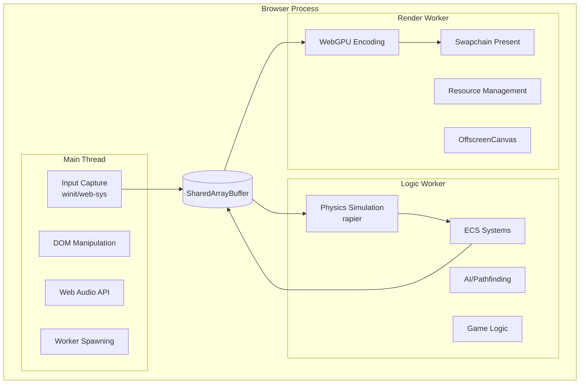
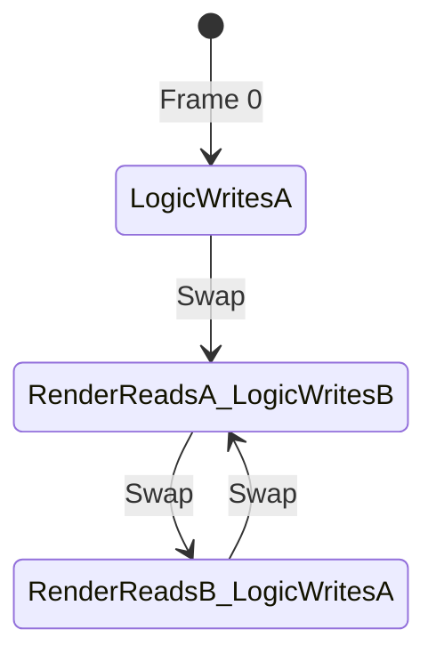
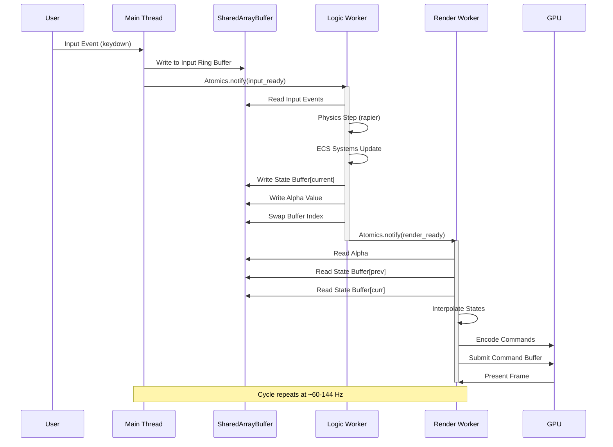

# Threading Model

This document defines the parallel execution model of Aether Engine, utilizing Web Workers and SharedArrayBuffer for high-performance multithreaded game execution in the browser.

---

## Table of Contents

1. [Architecture Overview](#1-architecture-overview)
2. [Thread Responsibilities](#2-thread-responsibilities)
3. [Data Synchronization Strategy](#3-data-synchronization-strategy)
4. [SharedArrayBuffer Layout](#4-sharedarraybuffer-layout)
5. [Lock-Free Communication](#5-lock-free-communication)
6. [Message Flow Diagram](#6-message-flow-diagram)
7. [Pitfalls and Cautions](#7-pitfalls-and-cautions)

---

## 1. Architecture Overview

Aether Engine employs a **three-thread architecture** optimized for WebAssembly execution:

| Thread          | Runtime Context      | Primary Role                        |
|-----------------|----------------------|-------------------------------------|
| Main Thread     | Browser Main Thread  | Input, DOM, Audio, Worker Lifecycle |
| Logic Worker    | Web Worker           | Physics, ECS, AI, Game State        |
| Render Worker   | Web Worker           | WebGPU Commands, Resource Mgmt      |



---

## 2. Thread Responsibilities

### 2.1. Main Thread

The Main Thread handles all browser-specific APIs that require main thread access.

**Responsibilities:**
- Capture user input via `winit` events or `web-sys` event listeners
- Manage DOM elements (loading screens, menus, overlays)
- Create and manage Web Audio context
- Spawn and terminate Web Workers
- Forward input events to Logic Worker via SharedArrayBuffer

**Constraints:**
- Must never block (no `Atomics.wait`)
- Must respond to browser events within 16ms to avoid jank
- Cannot directly access WebGPU (delegated to Render Worker)

```rust
// Main thread input forwarding (pseudo-code)
fn on_input_event(event: InputEvent) {
    // Write to input ring buffer in SharedArrayBuffer
    let write_idx = input_write_index.fetch_add(1, Ordering::AcqRel);
    input_buffer[write_idx % BUFFER_SIZE] = event.encode();
    
    // Signal Logic Worker (non-blocking)
    Atomics::notify(&input_ready, 1);
}
```

### 2.2. Logic Worker

The Logic Worker runs game simulation at a fixed timestep for deterministic behavior.

**Responsibilities:**
- Run physics simulation using `rapier` at fixed timestep (e.g., 60Hz or 120Hz)
- Execute ECS systems for game logic
- Process AI and pathfinding
- Read input from SharedArrayBuffer
- Write game state snapshots for Render Worker

**Timing:**
- Fixed timestep: 16.67ms (60Hz) or 8.33ms (120Hz)
- Accumulator-based update loop
- Stores previous and current state for interpolation

```rust
// Logic Worker main loop
fn logic_worker_main(shared: &SharedState) {
    const FIXED_DT: f32 = 1.0 / 60.0;
    let mut accumulator = 0.0;
    let mut last_time = now();
    
    loop {
        let current_time = now();
        let frame_time = (current_time - last_time).min(0.25); // Clamp spiral
        last_time = current_time;
        accumulator += frame_time;
        
        // Read input from shared buffer
        let input = shared.read_input();
        
        while accumulator >= FIXED_DT {
            // Store previous state before update
            shared.swap_state_buffers();
            
            // Run fixed-step simulation
            physics_step(&mut world, FIXED_DT);
            run_ecs_systems(&mut world, input, FIXED_DT);
            
            accumulator -= FIXED_DT;
        }
        
        // Write interpolation alpha for renderer
        let alpha = accumulator / FIXED_DT;
        shared.write_alpha(alpha);
        
        // Signal render worker
        Atomics::notify(&shared.render_ready, 1);
        
        // Wait for next frame (can use Atomics.wait in Worker)
        Atomics::wait(&shared.logic_tick, 0);
    }
}
```

### 2.3. Render Worker

The Render Worker handles all GPU operations using an OffscreenCanvas.

**Responsibilities:**
- Manage WebGPU Device, Queue, and Resources
- Encode render commands into GPUCommandBuffers
- Read interpolated game state from SharedArrayBuffer
- Present frames via OffscreenCanvas at maximum refresh rate
- Handle resource streaming and GPU memory management

**Timing:**
- Variable timestep: Matches `requestAnimationFrame` (typically 60Hz or 144Hz)
- Interpolates between logic states using alpha value

```rust
// Render Worker main loop
fn render_worker_main(shared: &SharedState, device: &Device, surface: &Surface) {
    loop {
        // Wait for new state from Logic Worker
        Atomics::wait(&shared.render_ready, 0);
        shared.render_ready.store(0, Ordering::Release);
        
        // Read interpolation alpha
        let alpha = shared.read_alpha();
        
        // Read previous and current state
        let prev_state = shared.read_previous_state();
        let curr_state = shared.read_current_state();
        
        // Interpolate transforms
        let render_state = interpolate(prev_state, curr_state, alpha);
        
        // Render frame
        let frame = surface.get_current_texture();
        let encoder = device.create_command_encoder();
        
        render_scene(&encoder, &render_state);
        
        queue.submit([encoder.finish()]);
        frame.present();
    }
}
```

---

## 3. Data Synchronization Strategy

### Double Buffered State

To prevent race conditions between the Logic Worker (writer) and Render Worker (reader), Aether Engine uses **double-buffered state snapshots**.



**Buffer Layout:**

| Buffer   | Logic Worker | Render Worker |
|----------|--------------|---------------|
| Buffer A | Write (Current) | Read (Previous) |
| Buffer B | Read (Previous) | Write (Current) |
| *After Swap* | | |
| Buffer A | Read (Previous) | Write (Current) |
| Buffer B | Write (Current) | Read (Previous) |

### Snapshot Interpolation

The renderer interpolates between two consecutive logic states to produce smooth visuals:

```rust
fn interpolate(prev: &State, curr: &State, alpha: f32) -> RenderState {
    RenderState {
        position: prev.position.lerp(curr.position, alpha),
        rotation: prev.rotation.slerp(curr.rotation, alpha),
        scale: prev.scale.lerp(curr.scale, alpha),
    }
}
```

**Alpha Calculation:**

```
alpha = accumulator / FIXED_TIMESTEP

Where:
  accumulator = leftover time after last logic tick
  alpha range = [0.0, 1.0)
  0.0 = render exactly at previous state
  1.0 = render exactly at current state
```

---

## 4. SharedArrayBuffer Layout

### Memory Map

```
Offset      Size        Description
──────────────────────────────────────────────────────
0x0000      64 B        Header (sync flags, counters)
0x0040      4 KB        Input Ring Buffer
0x1040      Variable    State Buffer A (transforms)
0xN000      Variable    State Buffer B (transforms)
0xM000      256 B       Performance Metrics
```

### Header Structure

```rust
#[repr(C)]
struct SharedHeader {
    // Synchronization (32 bytes)
    input_write_index: AtomicU32,     // 0x00
    input_read_index: AtomicU32,      // 0x04
    render_ready: AtomicU32,          // 0x08
    logic_tick: AtomicU32,            // 0x0C
    current_buffer: AtomicU32,        // 0x10: 0 = A, 1 = B
    interpolation_alpha: AtomicU32,   // 0x14: Fixed-point 0-65535
    frame_number: AtomicU64,          // 0x18
    
    // Counts (32 bytes)
    entity_count: AtomicU32,          // 0x20
    _reserved: [u8; 28],              // 0x24-0x3F
}
```

### Transform Data Layout (SoA)

```rust
// Structure of Arrays for cache efficiency
struct TransformBuffers {
    // Entity count N, each array has N elements
    positions: [f32; N * 4],    // vec4 (x, y, z, w=1)
    rotations: [f32; N * 4],    // quat (x, y, z, w)
    scales: [f32; N * 4],       // vec4 (x, y, z, w=1)
    entity_ids: [u32; N],       // Entity lookup
}
```

---

## 5. Lock-Free Communication

### Ring Buffer for Input Events

```rust
const INPUT_BUFFER_SIZE: usize = 256;

struct InputRingBuffer {
    events: [InputEvent; INPUT_BUFFER_SIZE],
    write_index: AtomicU32,  // Incremented by Main Thread
    read_index: AtomicU32,   // Incremented by Logic Worker
}

impl InputRingBuffer {
    // Main Thread: Non-blocking write
    fn push(&self, event: InputEvent) -> bool {
        let write = self.write_index.load(Ordering::Acquire);
        let read = self.read_index.load(Ordering::Acquire);
        
        if write - read >= INPUT_BUFFER_SIZE as u32 {
            return false; // Buffer full
        }
        
        let idx = (write % INPUT_BUFFER_SIZE as u32) as usize;
        self.events[idx] = event;
        self.write_index.store(write + 1, Ordering::Release);
        true
    }
    
    // Logic Worker: Non-blocking read
    fn pop(&self) -> Option<InputEvent> {
        let read = self.read_index.load(Ordering::Acquire);
        let write = self.write_index.load(Ordering::Acquire);
        
        if read >= write {
            return None; // Buffer empty
        }
        
        let idx = (read % INPUT_BUFFER_SIZE as u32) as usize;
        let event = self.events[idx];
        self.read_index.store(read + 1, Ordering::Release);
        Some(event)
    }
}
```

### Atomic Signaling

```rust
// Logic Worker signals Render Worker
fn signal_render_ready(shared: &SharedHeader) {
    shared.render_ready.store(1, Ordering::Release);
    // Wake up Render Worker if waiting
    Atomics_notify(&shared.render_ready, 1);
}

// Render Worker waits for new frame
fn wait_for_render_ready(shared: &SharedHeader) {
    while shared.render_ready.load(Ordering::Acquire) == 0 {
        // Atomics.wait is allowed in Workers (not Main Thread)
        Atomics_wait(&shared.render_ready, 0, TIMEOUT_MS);
    }
    shared.render_ready.store(0, Ordering::Release);
}
```

---

## 6. Message Flow Diagram



---

## 7. Pitfalls and Cautions

> [!CAUTION]
> **Critical Threading Issues**

### 7.1. Atomics.wait Forbidden on Main Thread

**Problem:** Calling `Atomics.wait()` on the Main Thread.

**Symptom:** Browser throws error: "Atomics.wait cannot be called in this context."

**Reason:** Blocking the Main Thread freezes the entire browser tab.

**Solution:** Only use `Atomics.wait()` in Web Workers. Main Thread must use non-blocking patterns:

```javascript
// WRONG: Main Thread
Atomics.wait(sharedArray, 0, 0);  // ERROR!

// CORRECT: Main Thread uses polling or message events
function checkReady() {
    if (Atomics.load(sharedArray, 0) === 1) {
        processData();
    } else {
        requestAnimationFrame(checkReady);
    }
}
```

---

### 7.2. SharedArrayBuffer Security Requirements

**Problem:** SharedArrayBuffer is disabled without proper headers.

**Symptom:** `SharedArrayBuffer is not defined` error.

**Solution:** Configure server with Cross-Origin Isolation headers:

```http
Cross-Origin-Opener-Policy: same-origin
Cross-Origin-Embedder-Policy: require-corp
```

---

### 7.3. Memory Ordering Bugs

**Problem:** Using `Ordering::Relaxed` when synchronization is required.

**Symptom:** Stale reads, torn writes, non-deterministic behavior.

**Solution:**
- Use `Ordering::Acquire` when reading data written by another thread
- Use `Ordering::Release` when writing data for another thread to read
- Use `Ordering::AcqRel` for read-modify-write operations

```rust
// WRONG
let value = shared.counter.load(Ordering::Relaxed);

// CORRECT
let value = shared.counter.load(Ordering::Acquire);
```

---

### 7.4. Buffer Overflow in Ring Buffer

**Problem:** Not checking buffer capacity before write.

**Symptom:** Overwriting unread data, input loss.

**Solution:** Always check available space:

```rust
fn push(&self, event: InputEvent) -> bool {
    let space = INPUT_BUFFER_SIZE as u32 - (write - read);
    if space == 0 {
        // Log warning: Input buffer full, dropping event
        return false;
    }
    // ... write event
}
```

---

### 7.5. Worker Termination Without Cleanup

**Problem:** Terminating workers without releasing GPU resources.

**Symptom:** WebGPU resource leaks, eventual browser crash.

**Solution:** Send shutdown message and wait for acknowledgment:

```javascript
// WRONG
worker.terminate();  // Immediate termination

// CORRECT
worker.postMessage({ type: 'shutdown' });
worker.onmessage = (e) => {
    if (e.data.type === 'shutdown_complete') {
        worker.terminate();
    }
};
```

---

## References

- [Web Workers API](https://developer.mozilla.org/en-US/docs/Web/API/Web_Workers_API)
- [SharedArrayBuffer](https://developer.mozilla.org/en-US/docs/Web/JavaScript/Reference/Global_Objects/SharedArrayBuffer)
- [Atomics](https://developer.mozilla.org/en-US/docs/Web/JavaScript/Reference/Global_Objects/Atomics)
- [Cross-Origin Isolation Guide](https://web.dev/cross-origin-isolation-guide/)
- [OffscreenCanvas](https://developer.mozilla.org/en-US/docs/Web/API/OffscreenCanvas)
