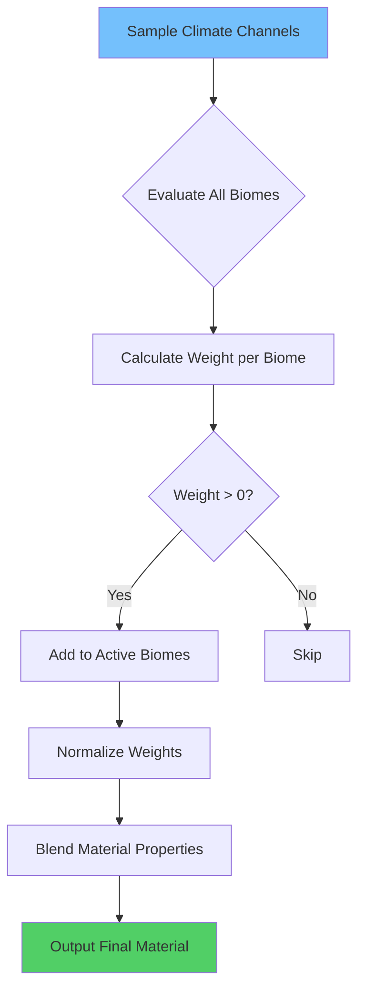
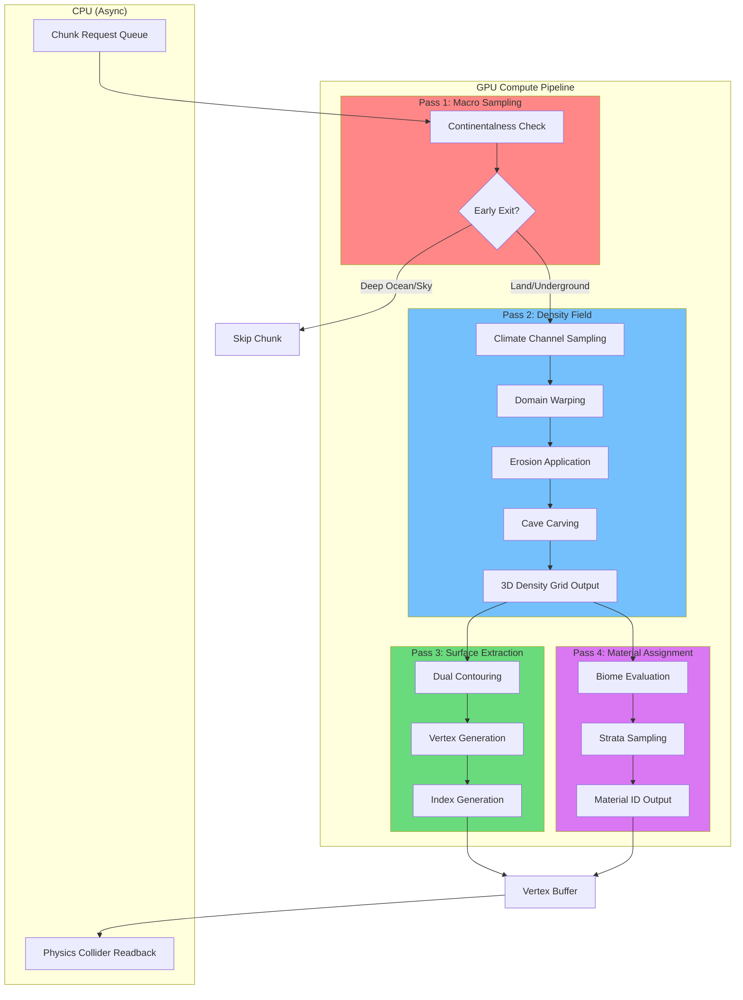
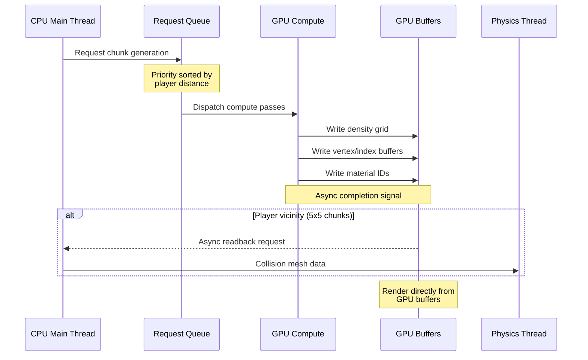

# World Generation Strategy

> **Document Version:** 1.0  
> **Status:** Authoritative Specification  
> **Subsystem:** Procedural World Generation (Aether Engine)

## Overview

This document defines the procedural world generation architecture for Aether Engine. The system employs a **3D Density Function** approach using **Dual Contouring** to produce scientifically plausible terrain with infinite fantasy potential. Unlike traditional heightmap systems, this architecture supports:

- Full volumetric terrain (caves, overhangs, floating islands)
- Continental-scale landmass formation
- Dynamic time evolution (seasonal/geological)
- GPU-native generation with zero CPU bottlenecks

---

## 1. The 5-Dimensional Climate Model (Macro Structure)

The world is defined through **independent macro noise channels** sampled at 5D coordinates:

$$\text{Sample}(x, y, z, t, c) \rightarrow \mathbb{R}$$

Where:
- $(x, y, z)$ = World-space position
- $t$ = Time (seasonal/geological)
- $c$ = Channel identifier

### 1.1 Channel Definitions

Each channel outputs normalized values in $[-1.0, 1.0]$ and controls distinct geological/climatic phenomena.

#### Channel 0: Continentalness

**Purpose:** Defines the fundamental land/ocean distribution and continental structure.

| Noise Value Range | Physical Zone | Characteristics |
|-------------------|---------------|-----------------|
| $[-1.0, -0.6)$ | Deep Ocean | Abyssal plains, no terrain generation |
| $[-0.6, -0.3)$ | Continental Shelf | Shallow underwater, coral potential |
| $[-0.3, 0.0)$ | Coastal Zone | Beaches, tidal flats, estuaries |
| $[0.0, 0.5)$ | Inland | Standard continental terrain |
| $[0.5, 1.0]$ | High Peaks | Mountain cores, alpine regions |

**Spline Remapping Function:**

Raw noise is remapped through a **cubic spline** to create distinct landmass boundaries:

$$C_{remapped} = \text{CubicSpline}(C_{raw}, \text{ControlPoints})$$

```
ControlPoints = [
    (-1.0, -1.0),   // Deep ocean stays deep
    (-0.4, -0.5),   // Gradual shelf transition
    (-0.1,  0.0),   // Sharp coastal definition
    ( 0.3,  0.4),   // Inland plateau
    ( 0.7,  0.6),   // Mountain foothills
    ( 1.0,  1.0)    // Peak preservation
]
```

This creates **distinct continental edges** rather than random noise blobs, simulating real tectonic plate boundaries.

#### Channel 1: Erosion

**Purpose:** Controls terrain ruggedness and weathering intensity.

$$E \in [-1.0, 1.0]$$

| Erosion Value | Terrain Effect |
|---------------|----------------|
| High ($E > 0.5$) | Flat plains, river valleys, sediment deposits |
| Medium ($E \in [-0.5, 0.5]$) | Rolling hills, moderate slopes |
| Low ($E < -0.5$) | Sharp peaks, cliff faces, minimal weathering |

**Application Formula:**

$$\text{TerrainHeight}_{final} = \text{TerrainHeight}_{base} \times (1.0 - |E| \times 0.7) + E \times \text{SedimentFill}$$

#### Channel 2: Peaks & Valleys (Ridge Noise)

**Purpose:** Defines the terrain spine using **absolute value ridge noise**.

$$P(x, z) = 1.0 - |N(x, z)|$$

Where $N$ is standard simplex noise. This creates:
- Sharp ridgelines where $|N| \approx 0$
- Broad valleys where $|N| \approx 1$

**Multi-Octave Ridge Formula:**

$$P_{final} = \sum_{i=0}^{n} \frac{(1.0 - |N(p \cdot 2^i)|)^2}{2^i}$$

The squaring operation creates sharper, more dramatic peaks.

#### Channel 3: Temperature

**Purpose:** Controls biome selection along the cold-hot axis.

$$T(y, latitude) = T_{base}(latitude) - \frac{y}{100} \times 0.65 + T_{seasonal}(t)$$

| Component | Formula | Effect |
|-----------|---------|--------|
| Base Temperature | $T_{base} = \cos(latitude \times \pi)$ | Equator warm, poles cold |
| Altitude Penalty | $-0.65°C$ per 100m | Realistic lapse rate |
| Seasonal Modifier | $T_{seasonal} = 0.15 \times \sin(t_{year} \times 2\pi)$ | Summer/winter variation |

**Snowline Calculation:**

$$\text{SnowlineY} = 2000 + 1500 \times T_{base} - 500 \times T_{seasonal}$$

#### Channel 4: Humidity

**Purpose:** Controls vegetation density, fog, and material wetness.

$$H = H_{base} \times (1.0 + \text{OceanProximity} \times 0.3) \times \text{RainShadow}$$

| Humidity Level | Effects |
|----------------|---------|
| $H > 0.7$ | Dense vegetation, frequent fog, wet materials |
| $H \in [0.3, 0.7]$ | Moderate vegetation, occasional precipitation |
| $H < 0.3$ | Sparse vegetation, arid materials, dust particles |

**Rain Shadow Modifier:**

$$\text{RainShadow} = \max(0.2, 1.0 - \text{MountainBlockage} \times 0.6)$$

#### Channel 5: Weirdness (Special Trigger)

**Purpose:** Rare activation channel for fantasy/alien terrain generation.

$$W \in [0.0, 1.0]$$

| Weirdness Range | Terrain Logic |
|-----------------|---------------|
| $[0.0, 0.98)$ | Standard geological rules apply |
| $[0.98, 0.99)$ | **Floating Islands:** Inverted gravity fields |
| $[0.99, 0.995)$ | **Crystal Pillars:** Gravity-defying vertical columns |
| $[0.995, 1.0]$ | **Void Rifts:** Negative-space anomalies |

**Activation Example (Floating Islands):**

```wgsl
if (weirdness > 0.98 && weirdness < 0.99) {
    // Invert density gradient above threshold
    let float_base = smoothstep(0.98, 0.99, weirdness);
    let inverted_y = anchor_height * 2.0 - world_pos.y;
    density = mix(density, calculate_density(vec3(world_pos.x, inverted_y, world_pos.z)), float_base);
}
```

---

## 2. Mathematical Techniques for Naturalness (Micro Detail)

### 2.1 Domain Warping

**Purpose:** Simulates geological folding and fluid-like terrain flow.

**Core Formula:**

$$f_{warped}(p) = f(p + g(p))$$

Where:
- $f$ = Original noise function
- $g$ = Warping displacement function
- $p$ = Sample position

**Multi-Layer Warping (Stacked):**

$$f_{final}(p) = f(p + g_1(p + g_2(p)))$$

**Implementation:**

```wgsl
fn domain_warp(p: vec3<f32>, amplitude: f32, frequency: f32) -> vec3<f32> {
    let warp = vec3<f32>(
        simplex_3d(p * frequency + vec3(0.0, 0.0, 0.0)),
        simplex_3d(p * frequency + vec3(5.2, 1.3, 0.0)),
        simplex_3d(p * frequency + vec3(0.0, 0.0, 9.4))
    );
    return p + warp * amplitude;
}

fn warped_terrain(p: vec3<f32>) -> f32 {
    let warped_pos = domain_warp(domain_warp(p, 100.0, 0.003), 50.0, 0.01);
    return fbm_3d(warped_pos, 6);
}
```

### 2.2 Hydraulic Erosion Approximation

**Purpose:** Simulate gullies and river channels without expensive simulation.

**Derivative Noise (Analytical Gradients):**

Instead of simulating water flow, we use **noise derivatives** to approximate erosion patterns:

$$\text{Erosion}(p) = \frac{\partial N}{\partial x}^2 + \frac{\partial N}{\partial z}^2$$

High gradient magnitude indicates steep slopes where erosion would carve channels.

**Gully Carving Formula:**

$$\text{Height}_{eroded} = \text{Height}_{base} - k \times \sqrt{|\nabla N|} \times \text{FlowAccumulation}$$

Where:
- $k$ = Erosion strength coefficient
- $\nabla N$ = Noise gradient at position
- $\text{FlowAccumulation}$ = Approximated via distance-to-ridge

**Analytical Gradient Computation:**

```wgsl
fn simplex_3d_derivative(p: vec3<f32>) -> vec4<f32> {
    // Returns (value, dx, dy, dz)
    // Implementation uses gradient extraction during noise evaluation
    // ... (full implementation in terrain_compute shader)
}

fn apply_hydraulic_erosion(height: f32, gradient: vec3<f32>, flow: f32) -> f32 {
    let slope = length(gradient.xz);
    let erosion_factor = sqrt(slope) * flow * EROSION_STRENGTH;
    return height - erosion_factor;
}
```

### 2.3 Terracing Functions

**Purpose:** Create stratified cliffs (sedimentary rock appearance).

**Smoothstep-Quantize Formula:**

$$T(h) = \text{round}(h \times n) / n + \text{smoothstep}(0, s, \text{fract}(h \times n)) / n$$

Where:
- $n$ = Number of terrace levels
- $s$ = Smoothing factor (controls cliff sharpness)

**Implementation:**

```wgsl
fn terrace(height: f32, levels: f32, sharpness: f32) -> f32 {
    let scaled = height * levels;
    let base = floor(scaled);
    let frac = fract(scaled);
    let smooth_frac = smoothstep(0.0, sharpness, frac);
    return (base + smooth_frac) / levels;
}
```

### 2.4 4D Noise Evolution

**Purpose:** Temporal variation for geological drift and seasonal changes.

**Time Injection Formula:**

$$N_{4D}(x, y, z, t) = N_{3D}(x, y, z + t \times k_{geo})$$

| Use Case | Time Coefficient $k$ | Period |
|----------|---------------------|--------|
| Seasonal (Snow Coverage) | $0.1$ | ~1 year game time |
| Weather (Cloud Shapes) | $1.0$ | ~1 day game time |
| Geological Drift | $0.0001$ | Visual-only, imperceptible |

**Seasonal Snow Example:**

```wgsl
fn calculate_snow_coverage(pos: vec3<f32>, time: f32) -> f32 {
    let seasonal_factor = sin(time * 2.0 * PI) * 0.5 + 0.5; // 0-1 over year
    let snow_noise = simplex_4d(vec4(pos * 0.1, time * 0.1));
    let altitude_factor = smoothstep(snowline - 200.0, snowline + 200.0, pos.y);
    return altitude_factor * seasonal_factor * (0.7 + snow_noise * 0.3);
}
```

---

## 3. Subsurface & Geological Architecture (The Underground)

### 3.1 3D Noise Tunneling

#### Spaghetti Noise (Tunnels)

**Purpose:** Thin, interconnected cave networks.

**Formula:**

$$S(p) = |N_1(p)| + |N_2(p \times 1.5)| - \text{threshold}$$

Where negative values indicate tunnel void.

```wgsl
fn spaghetti_caves(p: vec3<f32>) -> f32 {
    let freq1 = 0.03;
    let freq2 = 0.045;
    let n1 = abs(simplex_3d(p * freq1));
    let n2 = abs(simplex_3d(p * freq2 + vec3(100.0)));
    let tunnel = n1 + n2 - 0.15; // threshold
    return tunnel; // negative = cave
}
```

#### Cheese Noise (Caverns)

**Purpose:** Large interconnected chambers.

**Formula:**

$$C(p) = N(p) - \text{threshold}_{cavern}$$

With threshold tuned for sparse, large voids.

```wgsl
fn cheese_caverns(p: vec3<f32>) -> f32 {
    let freq = 0.008;
    let noise = simplex_3d(p * freq);
    return noise - 0.6; // High threshold = rare but large caverns
}
```

#### Combined Underground Density

```wgsl
fn underground_density(p: vec3<f32>, base_density: f32) -> f32 {
    let spaghetti = spaghetti_caves(p);
    let cheese = cheese_caverns(p);
    let cave_carve = min(spaghetti, cheese);
    return max(base_density, cave_carve);
}
```

### 3.2 Geological Strata System

**Purpose:** Define rock types based on depth with realistic layer variation.

#### Strata Definition

| Depth Range | Base Material | Noise Modulation |
|-------------|---------------|------------------|
| 0-20m | Topsoil/Grass | Surface biome dependent |
| 20-50m | Sedimentary (Sandstone/Limestone) | Wave frequency: 0.02 |
| 50-150m | Shale/Slate | Wave frequency: 0.015 |
| 150-400m | Granite/Basite | Wave frequency: 0.01 |
| 400m+ | Deep Stone/Magma proximity | Low frequency variation |

#### Wave-Modulated Boundaries

Instead of flat layer boundaries, use **wave noise** to create realistic geological folding:

$$\text{LayerY}_{actual} = \text{LayerY}_{base} + N(x, z) \times \text{WaveAmplitude}$$

```wgsl
fn get_strata_material(world_pos: vec3<f32>) -> u32 {
    let depth = surface_height(world_pos.xz) - world_pos.y;
    
    // Wave-modulated layer boundaries
    let wave = simplex_2d(world_pos.xz * 0.02) * 15.0;
    let adjusted_depth = depth + wave;
    
    if (adjusted_depth < 20.0) { return MATERIAL_TOPSOIL; }
    if (adjusted_depth < 50.0 + wave * 0.5) { return MATERIAL_SANDSTONE; }
    if (adjusted_depth < 150.0 + wave) { return MATERIAL_SHALE; }
    if (adjusted_depth < 400.0 + wave * 2.0) { return MATERIAL_GRANITE; }
    return MATERIAL_DEEP_STONE;
}
```

#### Strata Boundary Dithering

**Purpose:** Avoid artificial straight lines at layer transitions.

**Technique:** Blend materials using noise-driven alpha at boundaries.

```wgsl
fn get_strata_blend(world_pos: vec3<f32>) -> MaterialBlend {
    let depth = calculate_adjusted_depth(world_pos);
    let boundary_noise = simplex_3d(world_pos * 0.1) * 5.0;
    
    // Example: sandstone-shale boundary at ~50m
    let boundary = 50.0;
    let blend_width = 8.0;
    let blend_factor = smoothstep(
        boundary - blend_width + boundary_noise,
        boundary + blend_width + boundary_noise,
        depth
    );
    
    return MaterialBlend {
        material_a: MATERIAL_SANDSTONE,
        material_b: MATERIAL_SHALE,
        blend: blend_factor
    };
}
```

### 3.3 Void Optimization Strategy

> [!IMPORTANT]
> Underground rendering must **never** expose the player to void or ungenerated space.

#### Surface-Only Rendering (Dual Contouring)

Dual Contouring inherently provides void optimization:

1. **Density Function Evaluation:** Only edges crossing the isosurface ($\rho = 0$) generate geometry
2. **Solid Volume Ignorance:** Pure solid ($\rho > 0$) or pure air ($\rho < 0$) cells produce zero vertices
3. **Natural Efficiency:** Underground solid rock generates no geometry—only cave surfaces do

```
┌─────────────────────────────────────────┐
│ SURFACE (Sky-exposed)                   │
│   ▓▓▓▓▓▓▓▓▓▓▓▓▓▓▓▓▓▓▓▓▓▓▓▓  ← Mesh     │
├─────────────────────────────────────────┤
│ SOLID ROCK (No geometry)                │
│   [No vertices generated - pure solid]  │
├─────────────────────────────────────────┤
│ CAVE INTERIOR                           │
│   ▓▓▓▓▓▓                ▓▓▓  ← Mesh     │
│       ░░░░░░░░░░░░░░░░░░                │
│   ▓▓▓▓▓▓▓▓▓▓▓▓▓▓▓▓▓▓▓▓▓▓▓▓  ← Mesh     │
└─────────────────────────────────────────┘
```

#### Instant Remeshing (Terrain Modification)

When terrain is modified (mining, explosions), GPU Compute regenerates mesh instantly:


**Critical Performance Target:** Chunk remesh ≤ 2ms (maintains 60fps with margin)

#### Visual Fallback: Underground Fog

As a defensive measure, underground environments use **black distance fog**:

```wgsl
fn apply_underground_fog(color: vec3<f32>, depth: f32, is_underground: bool) -> vec3<f32> {
    if (!is_underground) { return color; }
    
    let fog_density = 0.02;
    let fog_color = vec3(0.02, 0.02, 0.03); // Near-black
    let fog_factor = 1.0 - exp(-depth * fog_density);
    
    return mix(color, fog_color, fog_factor);
}
```

This masks any potential loading artifacts at render distance boundaries.

---

## 4. Biome Architecture & Optimization

### 4.1 Data-Driven Biome Blending

#### Biome Table Structure

Biomes are defined in a **GPU Storage Buffer** (read-only), eliminating shader branching:

```wgsl
struct BiomeData {
    // Identification
    id: u32,
    name_hash: u32,
    
    // Climate thresholds
    temp_min: f32,
    temp_max: f32,
    humidity_min: f32,
    humidity_max: f32,
    altitude_min: f32,
    altitude_max: f32,
    
    // Visual properties
    base_color: vec3<f32>,
    texture_id_primary: u32,
    texture_id_secondary: u32,
    texture_blend_scale: f32,
    
    // PBR properties
    roughness: f32,
    metallic: f32,
    
    // Vegetation
    vegetation_density: f32,
    tree_type_id: u32,
};

@group(0) @binding(0)
var<storage, read> biome_table: array<BiomeData, 64>;
```

#### Biome Selection Algorithm



**Weight Calculation:**

$$W_i = \text{clamp}\left(\min\left(\frac{T - T_{min}^i}{\epsilon}, \frac{T_{max}^i - T}{\epsilon}, \frac{H - H_{min}^i}{\epsilon}, \frac{H_{max}^i - H}{\epsilon}\right), 0, 1\right)$$

**Property Blending (Branch-Free):**

```wgsl
fn blend_biome_materials(
    temp: f32, 
    humidity: f32, 
    altitude: f32
) -> MaterialOutput {
    var total_weight = 0.0;
    var blended_color = vec3(0.0);
    var blended_roughness = 0.0;
    var blended_texture_id = 0u;
    var max_weight = 0.0;
    
    for (var i = 0u; i < 64u; i++) {
        let biome = biome_table[i];
        let weight = calculate_biome_weight(biome, temp, humidity, altitude);
        
        if (weight > 0.0) {
            total_weight += weight;
            blended_color += biome.base_color * weight;
            blended_roughness += biome.roughness * weight;
            
            // Dominant texture selection
            if (weight > max_weight) {
                max_weight = weight;
                blended_texture_id = biome.texture_id_primary;
            }
        }
    }
    
    if (total_weight > 0.0) {
        blended_color /= total_weight;
        blended_roughness /= total_weight;
    }
    
    return MaterialOutput {
        color: blended_color,
        roughness: blended_roughness,
        texture_id: blended_texture_id
    };
}
```

### 4.2 Visual Weathering (Zero-Cost Dynamic Terrain)

**Principle:** Modify **material properties only**, never mesh geometry, for weather/seasonal effects.

#### Weather-Driven Material Modulation

| Weather State | Albedo Modifier | Roughness Modifier | Normal Modifier |
|---------------|-----------------|-------------------|-----------------|
| Rain | Darken 10-20% | -0.3 (wet gloss) | Micro-ripples |
| Snow | Blend white overlay | +0.2 (matte) | Smooth bias |
| Dry/Hot | Lighten 5% | +0.1 (dusty) | Cracked overlay |
| Fog | Desaturate 30% | Unchanged | Soften details |

**Implementation:**

```wgsl
struct WeatherState {
    wetness: f32,         // 0.0 = dry, 1.0 = soaked
    snow_coverage: f32,   // 0.0 = none, 1.0 = full
    dust_factor: f32,     // 0.0 = clean, 1.0 = dusty
    temperature: f32,     // Affects frost/heat effects
};

fn apply_weather_to_material(
    base: MaterialOutput, 
    weather: WeatherState,
    normal_up_factor: f32  // How horizontal is surface
) -> MaterialOutput {
    var result = base;
    
    // Wetness effect
    result.color *= mix(1.0, 0.8, weather.wetness);
    result.roughness = mix(result.roughness, 0.1, weather.wetness * 0.6);
    
    // Snow coverage (only on upward-facing surfaces)
    let snow_blend = weather.snow_coverage * normal_up_factor;
    result.color = mix(result.color, vec3(0.95, 0.97, 1.0), snow_blend);
    result.roughness = mix(result.roughness, 0.8, snow_blend);
    
    // Dust effect
    let dust_color = vec3(0.76, 0.70, 0.60);
    result.color = mix(result.color, dust_color, weather.dust_factor * 0.3);
    
    return result;
}
```

#### Seasonal Texture Layer

```wgsl
fn sample_seasonal_texture(
    uv: vec2<f32>, 
    base_texture: texture_2d<f32>,
    season: f32  // 0.0 = spring, 0.25 = summer, 0.5 = autumn, 0.75 = winter
) -> vec4<f32> {
    let base = textureSample(base_texture, sampler_linear, uv);
    
    // Autumn foliage tint
    let autumn_factor = 1.0 - abs(season - 0.5) * 4.0;
    let autumn_tint = vec3(1.0, 0.7, 0.3);
    
    // Winter desaturation
    let winter_factor = max(0.0, (season - 0.6) * 2.5);
    let desaturated = vec3(dot(base.rgb, vec3(0.299, 0.587, 0.114)));
    
    var color = base.rgb;
    color = mix(color, color * autumn_tint, max(0.0, autumn_factor) * 0.4);
    color = mix(color, desaturated, winter_factor * 0.5);
    
    return vec4(color, base.a);
}
```

---

## 5. GPU Compute Pipeline Specification

### 5.1 Pipeline Architecture



### 5.2 Pipeline Stages Detail

#### Stage 1: Macro Pass (Low Resolution)

**Purpose:** Early rejection of empty/ocean/sky chunks.

**Resolution:** 1 sample per chunk (or 2x2x2 coarse grid)

```wgsl
@compute @workgroup_size(8, 8, 1)
fn macro_pass(@builtin(global_invocation_id) id: vec3<u32>) {
    let chunk_world_pos = chunk_origin + vec3<f32>(id) * CHUNK_SIZE;
    let center = chunk_world_pos + vec3(CHUNK_SIZE * 0.5);
    
    // Sample continentalness at chunk center
    let continentalness = sample_continentalness(center.xz);
    
    // Early exit conditions
    if (continentalness < -0.8) {
        // Deep ocean - mark chunk as water-only
        chunk_metadata[chunk_id].type = CHUNK_OCEAN;
        return;
    }
    
    if (center.y > MAX_TERRAIN_HEIGHT + 100.0) {
        // Above max terrain - mark as sky
        chunk_metadata[chunk_id].type = CHUNK_SKY;
        return;
    }
    
    // Mark for detailed generation
    chunk_metadata[chunk_id].type = CHUNK_TERRAIN;
    atomicAdd(&pending_density_chunks, 1u);
}
```

#### Stage 2: Density Pass (High Resolution)

**Purpose:** Full SDF calculation with all geological effects.

**Resolution:** Full chunk resolution (typically 32³ or 64³)

```wgsl
@compute @workgroup_size(4, 4, 4)
fn density_pass(@builtin(global_invocation_id) id: vec3<u32>) {
    let world_pos = chunk_origin + vec3<f32>(id) * VOXEL_SIZE;
    
    // 1. Sample all climate channels
    let climate = sample_climate_channels(world_pos);
    
    // 2. Apply domain warping
    let warped_pos = apply_domain_warp(world_pos, climate.continentalness);
    
    // 3. Calculate base terrain SDF
    var density = calculate_base_terrain(warped_pos, climate);
    
    // 4. Apply erosion modifications
    density = apply_erosion(density, world_pos, climate.erosion);
    
    // 5. Carve underground features
    if (world_pos.y < surface_estimate(world_pos.xz)) {
        density = apply_underground_carving(density, world_pos);
    }
    
    // 6. Apply weirdness features
    if (climate.weirdness > 0.98) {
        density = apply_weird_terrain(density, world_pos, climate.weirdness);
    }
    
    // Store density
    density_grid[id.x + id.y * CHUNK_DIM + id.z * CHUNK_DIM * CHUNK_DIM] = density;
}
```

#### Stage 3: Surface Extraction (Dual Contouring)

**Purpose:** Extract mesh from density field.

**Algorithm:** Dual Contouring with QEF (Quadric Error Function) vertex placement.

```wgsl
@compute @workgroup_size(4, 4, 4)
fn dual_contour_pass(@builtin(global_invocation_id) id: vec3<u32>) {
    // Examine 2x2x2 cell
    let cell_densities = load_cell_densities(id);
    
    // Check if cell contains surface
    let edge_mask = calculate_edge_crossings(cell_densities);
    if (edge_mask == 0u) { return; } // No surface
    
    // Calculate edge intersection points
    var intersections: array<vec3<f32>, 12>;
    var intersection_count = 0u;
    for (var e = 0u; e < 12u; e++) {
        if ((edge_mask & (1u << e)) != 0u) {
            intersections[intersection_count] = calculate_edge_intersection(id, e, cell_densities);
            intersection_count++;
        }
    }
    
    // Solve QEF for optimal vertex position
    let vertex_pos = solve_qef(intersections, intersection_count);
    
    // Allocate and write vertex
    let vertex_index = atomicAdd(&vertex_count, 1u);
    vertices[vertex_index] = Vertex {
        position: vertex_pos,
        normal: calculate_gradient(vertex_pos),
        cell_id: id
    };
    
    // Store vertex index for face generation
    cell_vertices[flatten_id(id)] = vertex_index;
}

@compute @workgroup_size(4, 4, 4)
fn generate_faces_pass(@builtin(global_invocation_id) id: vec3<u32>) {
    // For each edge crossing, generate quad between adjacent cells
    // ... (face generation logic)
}
```

#### Stage 4: Material Pass

**Purpose:** Assign biome and geological materials per vertex.

```wgsl
@compute @workgroup_size(64, 1, 1)
fn material_pass(@builtin(global_invocation_id) id: vec3<u32>) {
    if (id.x >= vertex_count) { return; }
    
    let vertex = vertices[id.x];
    let world_pos = chunk_origin + vertex.position;
    
    // Determine if underground
    let surface_y = estimate_surface_height(world_pos.xz);
    let is_underground = world_pos.y < surface_y - 5.0;
    
    var material_id: u32;
    
    if (is_underground) {
        // Use strata system
        material_id = get_strata_material(world_pos, surface_y);
    } else {
        // Use biome system
        let climate = sample_climate_channels(world_pos);
        material_id = evaluate_biome(climate.temperature, climate.humidity, world_pos.y);
    }
    
    // Write to vertex data
    vertex_materials[id.x] = material_id;
}
```

### 5.3 CPU-GPU Data Flow



**Key Principles:**

1. **Zero CPU Generation:** All terrain generation executes on GPU
2. **Minimal Readback:** Only immediate player vicinity (5×5 chunks) requires CPU-side collision data
3. **Async Everything:** Readback operations are non-blocking
4. **Direct Rendering:** Vertex buffers render directly without CPU involvement

#### Async Readback Specification

```wgsl
// CPU requests readback for physics chunks only
struct ReadbackRequest {
    chunk_id: u32,
    priority: f32,  // Based on player distance
    callback_id: u32,
};

// Staging buffer for CPU readback
@group(1) @binding(0)
var<storage, read_write> physics_staging: array<PhysicsVertex, MAX_PHYSICS_VERTS>;
```

**Latency Budget:**
- Readback latency: ≤ 3 frames (acceptable for physics at 60fps)
- Chunk generation: ≤ 16ms (one frame budget)
- Mesh update after modification: ≤ 2ms

---

## Appendix A: Noise Function Reference

| Function | Formula | Primary Use |
|----------|---------|-------------|
| Simplex 2D/3D | Standard simplex | Base terrain, caves |
| Simplex 4D | Time-extended simplex | Seasonal variation |
| Ridge Noise | $1 - |N(p)|$ | Mountain spines |
| FBM | $\sum \frac{N(p \cdot 2^i)}{2^i}$ | Detail layering |
| Domain Warp | $N(p + g(p))$ | Geological folding |
| Analytical Gradient | $\nabla N(p)$ | Erosion approximation |

## Appendix B: Performance Targets

| Metric | Target | Measurement |
|--------|--------|-------------|
| Chunk Generation | ≤ 16ms | GPU timer query |
| Mesh Modification | ≤ 2ms | GPU timer query |
| Physics Readback | ≤ 50ms async | CPU timer |
| Memory per Chunk | ≤ 2MB vertices | Buffer allocation |
| Simultaneous Chunks | 64 in-flight | Queue depth |

---

*Document authored for Aether Engine procedural generation subsystem.*
