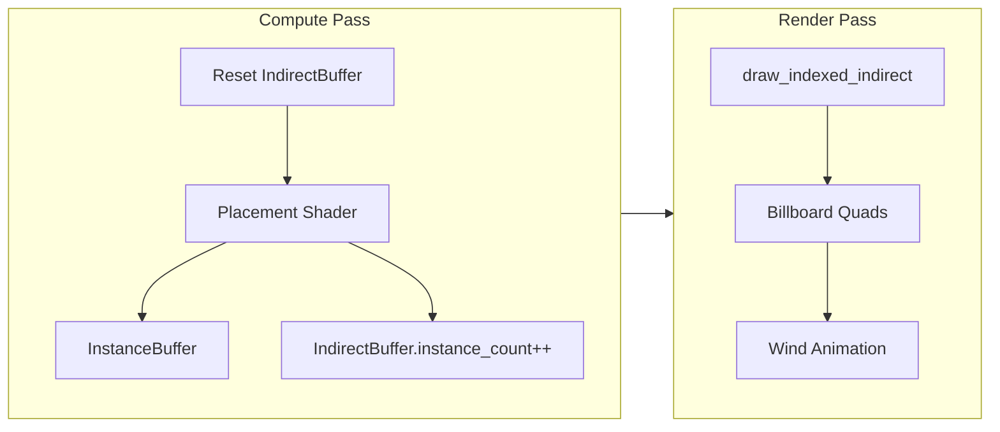

# Task 12: GPU-Driven Vegetation System

**Status:** 🔲 Not Started  
**Priority:** High  
**Depends On:** Task 11 (Biome System)

---

## Goal

Implement a GPU-driven vegetation system using Compute Shaders for procedural placement and Indirect Drawing for zero-CPU-overhead rendering. Target: 100,000+ grass blades at < 1ms CPU cost.

**Reference:** [data_layout.md](../01_STANDARDS/data_layout.md)

---

## Architecture Overview



**Key Insight:** CPU never touches instance data. GPU atomically appends instances and sets draw count.

---

## Implementation Steps

### Step 1: Vegetation Infrastructure

**File:** `src/core/renderer/vegetation.rs`

```rust
#[repr(C)]
#[derive(Copy, Clone, Pod, Zeroable)]
pub struct GrassInstance {
    pub position: [f32; 3],  // World position
    pub scale: f32,          // Height variation
    pub rotation: f32,       // Y-axis rotation
    pub type_id: u32,        // 0=grass, 1=flower, 2=rock
    pub _padding: [f32; 2],  // 32-byte alignment
}

#[repr(C)]
#[derive(Copy, Clone, Pod, Zeroable)]
pub struct DrawIndexedIndirect {
    pub index_count: u32,      // 6 for cross-quad
    pub instance_count: u32,   // GPU sets this!
    pub first_index: u32,      // 0
    pub base_vertex: i32,      // 0
    pub first_instance: u32,   // 0
}
```

**Buffers:**
| Buffer | Usage | Size |
|--------|-------|------|
| `instance_buffer` | STORAGE | MAX_INSTANCES × 32 bytes |
| `indirect_buffer` | INDIRECT + STORAGE | 20 bytes |
| `counter_buffer` | STORAGE | 4 bytes (atomic counter) |

---

### Step 2: Placement Compute Shader

**File:** `assets/shaders/vegetation_compute.wgsl`

```wgsl
struct GrassInstance {
    position: vec3<f32>,
    scale: f32,
    rotation: f32,
    type_id: u32,
    _padding: vec2<f32>,
}

@group(0) @binding(0) var<storage, read_write> instances: array<GrassInstance>;
@group(0) @binding(1) var<storage, read_write> indirect: DrawIndexedIndirect;
@group(0) @binding(2) var<storage, read_write> counter: atomic<u32>;

@compute @workgroup_size(8, 8, 1)
fn cs_place_vegetation(@builtin(global_invocation_id) gid: vec3<u32>) {
    let world_x = f32(gid.x) * VEGETATION_SPACING + chunk_offset_x;
    let world_z = f32(gid.y) * VEGETATION_SPACING + chunk_offset_z;
    
    // Sample terrain height and normal
    let height = get_terrain_height(world_x, world_z);
    let normal = get_terrain_normal(world_x, world_z);
    
    // === Placement Rules ===
    // 1. Skip underwater
    if (height < 0.0) { return; }
    
    // 2. Skip steep slopes (> 45 degrees)
    if (normal.y < 0.707) { return; }
    
    // 3. Skip rocks/snow zones
    let temp = get_temperature(world_x, world_z);
    if (temp < -0.5 || height > 100.0) { return; }
    
    // 4. Density noise (skip some for natural look)
    let density_noise = random(vec2(world_x, world_z));
    if (density_noise < 0.3) { return; }
    
    // === Append Instance ===
    let idx = atomicAdd(&counter, 1u);
    if (idx >= MAX_INSTANCES) { return; }
    
    instances[idx].position = vec3(world_x, height, world_z);
    instances[idx].scale = 0.8 + random(vec2(world_x + 1.0, world_z)) * 0.4;
    instances[idx].rotation = random(vec2(world_x, world_z + 1.0)) * 6.28;
    instances[idx].type_id = 0u; // Grass
    
    // Update indirect draw count
    atomicMax(&indirect.instance_count, idx + 1u);
}
```

---

### Step 3: Rendering Shader

**File:** `assets/shaders/vegetation_render.wgsl`

```wgsl
@vertex
fn vs_grass(
    @builtin(vertex_index) vid: u32,
    @builtin(instance_index) iid: u32
) -> VertexOutput {
    let instance = instances[iid];
    let local_pos = grass_vertices[vid];
    
    // Wind animation (top bends, bottom fixed)
    let wind_strength = local_pos.y * 0.5;  // More movement at tip
    let wind_offset = sin(time + instance.position.x * 0.5) * wind_strength;
    
    // Billboard rotation (Y-axis only for grass)
    let rot = mat2x2<f32>(
        cos(instance.rotation), -sin(instance.rotation),
        sin(instance.rotation), cos(instance.rotation)
    );
    
    var world_pos = instance.position;
    world_pos.xz += rot * local_pos.xz * instance.scale;
    world_pos.x += wind_offset;
    world_pos.y += local_pos.y * instance.scale;
    
    var out: VertexOutput;
    out.clip_position = view_proj * vec4(world_pos, 1.0);
    out.uv = grass_uvs[vid];
    out.type_id = instance.type_id;
    return out;
}

@fragment
fn fs_grass(in: VertexOutput) -> @location(0) vec4<f32> {
    let color = textureSample(vegetation_atlas, sampler, in.uv, in.type_id);
    if (color.a < 0.5) { discard; }  // Alpha test for grass edges
    return color;
}
```

---

### Step 4: Integration

**File:** `src/core/renderer/mod.rs`

```rust
// In render():
// 1. Reset indirect buffer
queue.write_buffer(&indirect_buffer, 4, &[0u32]);  // Set instance_count = 0

// 2. Compute pass: place vegetation
{
    let mut compute_pass = encoder.begin_compute_pass(...);
    compute_pass.set_pipeline(&vegetation_compute_pipeline);
    compute_pass.set_bind_group(0, &vegetation_bind_group, &[]);
    compute_pass.dispatch_workgroups(grid_x, grid_z, 1);
}

// 3. Render pass: draw vegetation
{
    render_pass.set_pipeline(&vegetation_render_pipeline);
    render_pass.set_bind_group(0, &vegetation_bind_group, &[]);
    render_pass.set_vertex_buffer(0, &grass_mesh_buffer);
    render_pass.set_index_buffer(&grass_index_buffer, IndexFormat::Uint16);
    render_pass.draw_indexed_indirect(&indirect_buffer, 0);
}
```

---

## Cross-Quad Mesh

Two intersecting quads for 3D appearance with minimal geometry:

```
    /\        Top view:
   /  \         +
  /    \       /|\
 /      \     / | \
 --------    +--+--+
```

**Vertices:** 8 (4 per quad)  
**Indices:** 12 (6 per quad, 2 triangles each)

---

## Verification Checklist

- [ ] Grass only on land (not underwater)
- [ ] No grass on cliffs (slope > 45°)
- [ ] No grass in snow zones (high altitude)
- [ ] Wind animation moves tips, not roots
- [ ] 100,000+ instances with stable FPS
- [ ] CPU render time < 1ms (single draw call)

---

## Performance Notes

| Technique | CPU Cost | GPU Cost |
|-----------|----------|----------|
| Traditional instancing | O(n) | Medium |
| **GPU Indirect** | **O(1)** | **Medium** |

The indirect buffer makes instance count invisible to CPU, enabling massive scale.
