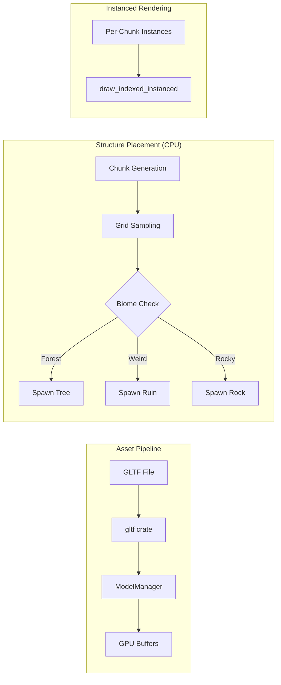

# Task 13: GLTF Asset Pipeline & Structure Placement System

**Status:** 🔲 Not Started  
**Priority:** High  
**Depends On:** Task 12 (Vegetation System)

---

## Goal

Implement a GLTF model loader and populate the world with Trees, Rocks, and Procedural Ruins using CPU-driven instanced rendering. Unlike grass (GPU-only), structures need collision detection, so placement is calculated on the CPU.

**Reference:** [data_layout.md](../01_STANDARDS/data_layout.md)

---

## Architecture Overview



**Why CPU Placement?**
- Large objects need physics/collision with player
- GPU readback for collision is expensive and complex
- Per-chunk instance lists enable future frustum culling

---

## Implementation Steps

### Step 1: Asset Pipeline

**File:** `src/core/assets/loader.rs`

**Cargo.toml:**
```toml
[dependencies]
gltf = "1.4"
```

**API:**
```rust
pub struct GltfMesh {
    pub vertices: Vec<MeshVertex>,
    pub indices: Vec<u32>,
    pub vertex_buffer: wgpu::Buffer,
    pub index_buffer: wgpu::Buffer,
}

pub fn load_gltf(device: &wgpu::Device, path: &str) -> Result<GltfMesh, GltfError>;
```

**Implementation Notes:**
- Parse positions, normals, UVs, indices
- Upload to GPU buffers immediately
- Skip skinning/animation (static meshes only)
- Support single-mesh files for now

---

### Step 2: Structure Data

**File:** `src/core/renderer/structures.rs`

```rust
#[derive(Clone, Copy, Debug, PartialEq, Eq, Hash)]
pub enum StructureType {
    TreePine,
    TreeOak,
    RockSmall,
    RockLarge,
    RuinPillar,
    RuinArch,
}

#[repr(C)]
#[derive(Copy, Clone, Pod, Zeroable)]
pub struct StructureInstance {
    pub transform: [[f32; 4]; 4],  // mat4x4
    pub structure_type: u32,
    pub _padding: [u32; 3],
}

pub struct ModelManager {
    models: HashMap<StructureType, GltfMesh>,
}

impl ModelManager {
    pub fn load_all(device: &wgpu::Device) -> Self;
    pub fn get(&self, stype: StructureType) -> &GltfMesh;
}
```

---

### Step 3: Placement Logic (CPU)

**File:** `src/core/renderer/structures.rs`

```rust
/// Generate structure instances for a chunk
pub fn generate_structures(
    chunk_x: i32, chunk_z: i32,
    seed: f32,
) -> Vec<StructureInstance> {
    let mut instances = Vec::new();
    let spacing = 8.0;  // Much sparser than grass
    
    for gx in 0..STRUCTURE_GRID_SIZE {
        for gz in 0..STRUCTURE_GRID_SIZE {
            let world_x = chunk_x as f32 * CHUNK_SIZE + gx as f32 * spacing;
            let world_z = chunk_z as f32 * CHUNK_SIZE + gz as f32 * spacing;
            
            // Deterministic hash for placement
            let hash = hash2d(vec2(world_x, world_z) + seed);
            
            // Density check (10% spawn rate)
            if hash > 0.1 { continue; }
            
            // Sample terrain
            let height = get_terrain_height(world_x, world_z, seed);
            let biome = get_biome(world_x, world_z, seed);
            
            // Placement rules
            if height < 3.0 { continue; }  // No underwater
            if height > 80.0 { continue; } // No snow zone
            
            let structure_type = match biome {
                Biome::Forest => if hash2d(vec2(world_x + 1.0, world_z)) > 0.5 {
                    StructureType::TreePine
                } else {
                    StructureType::TreeOak
                },
                Biome::Rocky => StructureType::RockSmall,
                _ => continue,
            };
            
            // Rare ruins (weirdness check)
            let weirdness = get_weirdness(world_x, world_z, seed);
            if weirdness > 0.9 {
                structure_type = StructureType::RuinPillar;
            }
            
            instances.push(StructureInstance {
                transform: create_transform(world_x, height, world_z, hash),
                structure_type: structure_type as u32,
                _padding: [0; 3],
            });
        }
    }
    
    instances
}
```

---

### Step 4: Instanced Rendering

**File:** `src/core/renderer/mod.rs`

```rust
// In render():
// Group instances by model type for batching
for (structure_type, instances) in chunk.structures.group_by_type() {
    let model = model_manager.get(structure_type);
    
    render_pass.set_pipeline(&structure_pipeline);
    render_pass.set_bind_group(0, &camera_bind_group, &[]);
    render_pass.set_bind_group(1, &instance_bind_group, &[]);
    render_pass.set_vertex_buffer(0, model.vertex_buffer.slice(..));
    render_pass.set_index_buffer(model.index_buffer.slice(..), IndexFormat::Uint32);
    render_pass.draw_indexed(
        0..model.index_count,
        0,
        0..instances.len() as u32,  // Instanced!
    );
}
```

**Pipeline Configuration:**
- Depth test: Less (enabled)
- Backface culling: Back
- Fill mode: Fill
- Blend: None (opaque)

---

## Asset Requirements

Place placeholder models in `assets/models/`:

| File | Description | Poly Target |
|------|-------------|-------------|
| `tree_pine.glb` | Conifer tree | < 500 |
| `tree_oak.glb` | Broadleaf tree | < 500 |
| `rock_small.glb` | Boulder | < 100 |
| `ruin_pillar.glb` | Ancient pillar | < 200 |

> **Note:** Use procedural mesh generation as fallback if no GLTF files present.

---

## Verification Checklist

- [ ] GLTF loader parses mesh data correctly
- [ ] ModelManager loads all structure types
- [ ] Trees spawn only in forest biomes
- [ ] Rocks spawn in rocky areas
- [ ] Ruins are rare (weirdness > 0.9)
- [ ] Structures align with terrain height
- [ ] Instanced rendering draws efficiently
- [ ] No z-fighting with terrain

---

## Future Optimizations

| Technique | Benefit |
|-----------|---------|
| Frustum Culling | Skip instances behind camera |
| LOD System | Reduce poly count at distance |
| Impostor Sprites | Replace distant trees with billboards |
| Collision Meshes | Simple box/capsule for physics |
